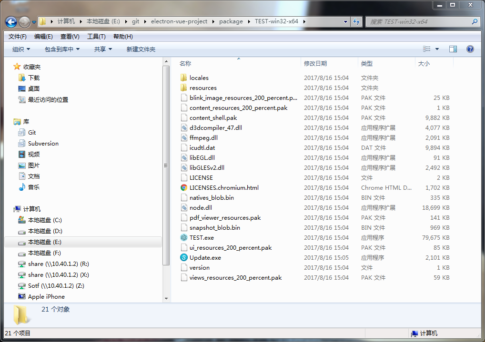
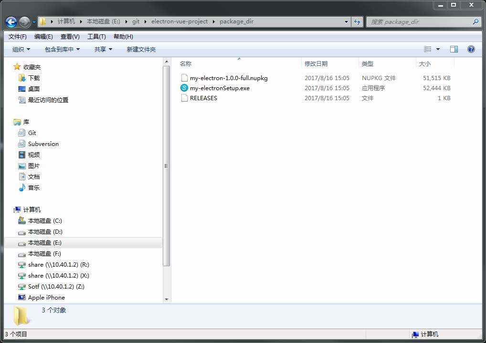
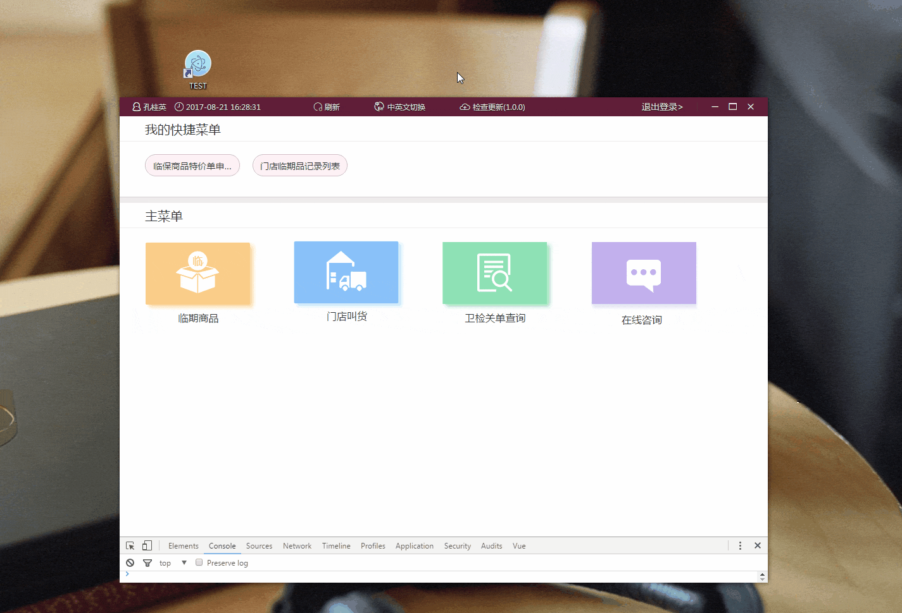
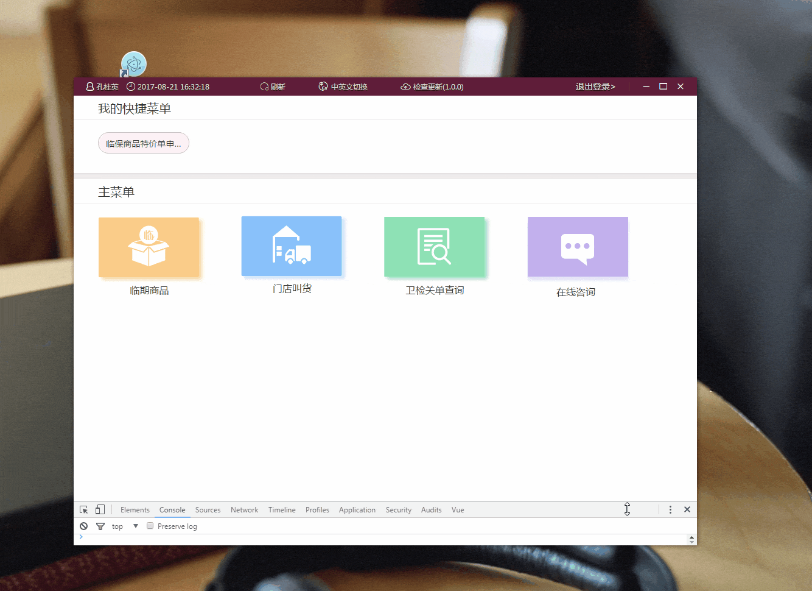

# electron + vue 实践项目[github](https://github.com/xiaobinwu/electron-vue-project)

#### 本地安装环境准备

* 安装node： * https://nodejs.org/en/download/
* 配置webpack： npm install -g webpack(sudo权限)
* windows配置cnpm：

```bash
    npm install -g cnpm --registry=https://registry.npm.taobao.org
    因为npm的默认仓库在国外，下载很慢，国内淘宝搞了个CNPM，每10分钟同步一次，完全够用了
```

* 当然也可以使用yarn下载
```bash
    npm install -g yarn
    yarn install
```


#### 依赖包安装
* 进入项目目录
* 执行cnpm install

#### 安装问题
> * cnpm install之后，可能会由于网络不好而导致一些包安装不完整，这里推荐使用yarn进行安装
> * 需要额外安装vue-style-loader、vue-template-compiler，不然vue-loader会报错
> * electron配置项（config.js）为true时，运行npm run dev，浏览器访问会报错， `Uncaught ReferenceError: require is not defined
`，原因可以去[这里](https://github.com/egoist/vuepack/issues/83)看，由于配置config.electron是开启状态，于是require被browserified化了，不是原先node原生require函数，所以在browser会出现此问题
> * 应用打包的时候，需要注意package.json的main配置项main，必须指向electron的主线程文件，此处为app/index.js

#### 字体引入问题
对于webpack对于引入字体文件一直都会有问题，有时候你使用了file-laoder，url-loader，但是在使用还是会存在一些问题，比如渲染进程入口文件components/App.vue希望引入`common.scss`，`common.scss`会去`@import iconfont.css`(字体样式)，这时候`iconfont.css`的字体路径就会出现问题，webpack一直提示找不到依赖路径。在开发环境下，我是将iconfont.cn获取的字体文件远程地址写进build/index.html，这样解决了问题。正式环境下，可以将字体文件代码引入到App.vue文件中去

### 功能列表
- [ ]  mac安装包生成
- [ ]  新增各个模块功能
- [x] windows安装包生成 -- 完成
- [x] 应用自动更新 -- 完成
- [x] 中英文切换 -- 完成
- [x] 全局快捷键绑定 -- 完成
- [x] 即时通讯功能 -- 完成
- [x] excel表格导入导出 -- 完成
- [x] 登录功能 -- 完成
- [x] mock.easy提供数据 -- 完成

development:

```bash

$ npm run dev
# express开启服务，可以通过`http://localhost:port`访问（热重载）
# 原理：通过electron创建主体窗口，`mainWindow.loadURL(http://localhost:port)`，加载应用的 index.html

$ npm run app
# 运行`electron ./`,生成桌面应用

```

socket.io:

```bash

$ npm run socket

使用express + mongoDB + socket.io引入基于node的即时通讯模块

```


本地调试时，只需运行`npm run dev` **=>** `npm run app`，需要开启即时通讯的功能的需要`npm run sock`，这里需要注意即时通讯模块目前没有迁移至服务器，要在本地运行，需要使用express起一个服务（`./socket/`），这里的数据库集成使用的是mongoDB，所以必须要安装[mongoDB](https://www.mongodb.com/)，然后配置环境变量（比如说我安装的目录是`d:`，我的环境变量这样配置，`D:\Program Files\MongoDB\Server\3.4\bin`），这样之后，便可以使用`mongod`、`mongo`命令了，执行`mongod`命令，一般会报错，默认存储文档的目录没有，那可以这样，新建一个文件夹，用来存储mongo产生的文档对象，执行`mongod --dbpath D:\mongodb\db`，至于mongo(models/sechemas)、socket.io、express如何搭配去实现即时通讯的的功能，具体可以看代码如何实现，对于这些新的东西，也只是了解个大概，后面准备花些时间去深入学习。


production:

```bash

$ npm run build
＃生成正式文件到app/dist目录（eletron应用目录）

```

package:

```bash

$ npm run package:mac
$ npm run package:win
$ npm run package:linux
$ npm run package

将上一步`npm run build`后生成的正式文件，进行打包，生成程序，打包至`./package`目录中

```



setup:

```bash

$ npm run setup

这里生成安装包（仅适合于window），将上一步生成的package，通过grunt和grunt-electron-installer完成打包，打包至`./package_dir`

```



生成安装包的过程：  
> * npm run build
> * npm run package:win（目前只支持window）
> * npm run setup

对于打包工具，这里使用的是`electron-packager`，安装命令：  

```
rimraf package && electron-packager . TEST --platform=win32 --arch=x64 --overwrite --icon=hosts.ico --out=./package --electron-version=1.6.11 --version-string.CompanyName=TEST --version-string.ProductName=TEST --ignore=\"(build|client$|static|theme|.gitignore|LICENSE|README.md|.editorconfig|.eslintrc|node_modules|gruntPackage.json|Gruntfile.js|yarn.lock|socket|package_dir|git_img)\"

```
参数：  
> * `.` => 应用目录
> * `TEST` => 应用名称
> * `--platform=win32` => 要打包的平台
> * `--overwrite` => 覆盖模式安装
> * `--icon=hosts.ico` => 应用图标（window时可以是`.ico`、`.png`，mac时可以为`.icns`）
> * `--out=./package` => 输出目录
> * `--electron-version` => electron版本
> * `--version-string.CompanyName=TEST --version-string.ProductName=TEST` => 为了生成安装包的时候，应用名字为`TEST`，而不是默认的`electron`
> * `--ignore=XXX` => 忽略打包的目录

详细可看[这里](https://github.com/electron-userland/electron-packager/blob/master/docs/api.md)


打包成安装程序，需要使用到`grunt`、`grunt-electron-installer`,请保证事先安装好  
在`package.json`设置：  
```
{
    "version": "1.0.0", // 这个是必须的，为了后面使用electron updater实现自动更新
    "productName": "my-electron",
    "description": "My Superb Vue Project For Electron",
    ......
}
```
Gruntfile.js文件如下[详细](https://www.npmjs.com/package/grunt-electron-installer)：  
```
var grunt = require('grunt')

// 配置
grunt.config.init({
    pkg: grunt.file.readJSON('package.json'), // 这里会去获取版本号
    'create-windows-installer': {
        x64: {
            authors: 'xiaobinwu <xiaobin_wu@yahoo.com>', // 作者
            projectUrl: '',
            appDirectory: './package/TEST-win32-x64', // 要打包的输入目录
            outputDirectory: './package_dir', // grunt打包后的输出目录
            exe: 'TEST.exe', // 生成的exe文件
            description: 'My Superb Vue Project For Electron',
            setupIcon: './app/hots.ico', // 图标
            noMsi: true // 是否生成.msi
        }
    }
})

// 加载任务
grunt.loadNpmTasks('grunt-electron-installer')

// 设置为默认
grunt.registerTask('default', ['create-windows-installer'])

```
于是就会生成如上图所示的`my-electronSetup.exe`，点击运行，进入一个安装的过程，会有安装的小动画，如下图：  
  
而我们需要的是安装完后自动生成快捷方式，这里使用的`electron-squirrel-startup`npm包，然后在主线程文件中app/index.js中写入`startupEventHandle`方法，安装时触发squirrel.window的一些命令，将其放在创建主体窗口的回调函数中，代码如下：

```
app.on('ready', function(){
    ......
    startupEventHandle()
    ......
})
......

function startupEventHandle () {
    if (require('electron-squirrel-startup')) { return }
    // 安装和更新时添加快捷方式，删除和卸载时删除快捷方式
    var handleStartupEvent = function () {
        if (process.platform !== 'win32') {
            return false
        }
        var squirrelCommand = process.argv[1]
        switch (squirrelCommand) {
            case '--squirrel-install':
            case '--squirrel-updated':
                install()
                return true
            case '--squirrel-uninstall':
                uninstall()
                app.quit()
                return true
            case '--squirrel-obsolete':
                app.quit()
                return true
        }
        // 安装
        function install () {
            var cp = require('child_process')
            var updateDotExe = path.resolve(path.dirname(process.execPath), '..', 'update.exe')
            var target = path.basename(process.execPath)
            var child = cp.spawn(updateDotExe, ['--createShortcut', target], { detached: true })
            child.on('close', function (code) {
                app.quit()
            })
        }
        // 卸载
        function uninstall () {
            var cp = require('child_process')
            var updateDotExe = path.resolve(path.dirname(process.execPath), '..', 'update.exe')
            var target = path.basename(process.execPath)
            var child = cp.spawn(updateDotExe, ['--removeShortcut', target], { detached: true })
            child.on('close', function (code) {
                app.quit()
            })
        }
    }
    if (handleStartupEvent()) {
        return
    }
}

```
这样便可以在安装时生成快捷方式，卸载时删除快捷方式了，在这个过程中，有可能回报`electron-squirrel-startup module not found`类似的错误，那是`electron-packager`打包时，过滤掉了`node_moudles`目录，所以需要手动添加到生成的package里面。至于网上的一些教程说，是需要安装vs2015环境，并且将msbuild程序声明成环境变量，但是我觉得应该是缺少npm包的原因，大家也可以试试，我本地是本来就安装过vs2015的。

lint:

```bash

$ npm run lint
# lint项目（配置规则：.eslintrc）

```
> 上面的npm run script命令可能有些多，涉及的内容也比较多，文章后面会一一讲解！下面上一波效果图：






#### electron自动更新
前面我们也有提到过自动更新，这里使用的官方提供的`electron.autoUpdater`模块去更新，坑爹的是官方对这一功能的描述真是少之又少，autoUpdater的一些方法和事件[这里](https://www.w3cschool.cn/electronmanual/electronmanual-auto-updater.html)可以去了解清楚，`autoUpdater.setFeedURL(url)`这一方法是重中之重，`url`放着高版本的文件(.exe,.nupkg,RELEASES)，这里我是存储在阿里oss,然后`autoUpdater.checkForUpdates()`会去检查是否需要更新，它会触发`error、checking-for-update、update-available、update-downloaded`中的一些事件，而我们需要利用主进程跟渲染进程之间的通讯（ipc/remote/webContent），来触发更新，具体代码如下：
```
function updateHandle () {
    ipcMain.on('check-for-update', function (event, arg) {
        if (process.platform !== 'win32') {
            return false
        }
        let appName = '门店系统'
        let appIcon = __dirname + '/hots.ico'
        let message = {
            error: '检查更新出错',
            checking: '正在检查更新……',
            updateAva: '下载更新成功',
            updateNotAva: '现在使用的就是最新版本，不用更新',
            downloaded: '最新版本已下载，将在重启程序后更新'
        }
        const os = require('os')
        const { dialog } = require('electron')
        // 放最新版本文件的文件夹的服务器地址
        // 阿里oss
        autoUpdater.setFeedURL('http://electron20170815.oss-cn-beijing.aliyuncs.com/electron/')
        autoUpdater.on('error', function (error) {
            return dialog.showMessageBox(mainWindow, {
                type: 'info',
                icon: appIcon,
                buttons: ['OK'],
                title: appName,
                message: message.error,
                detail: '\r' + error
            })
        })
        .on('checking-for-update', function (e) {
            return dialog.showMessageBox(mainWindow, {
                type: 'info',
                icon: appIcon,
                buttons: ['OK'],
                title: appName,
                message: message.checking
            })
        })
        .on('update-available', function (e) {
            var downloadConfirmation = dialog.showMessageBox(mainWindow, {
                type: 'info',
                icon: appIcon,
                buttons: ['OK'],
                title: appName,
                message: message.updateAva
            })
            if (downloadConfirmation === 0) {
                return
            }
        })
        .on('update-not-available', function (e) {
            return dialog.showMessageBox(mainWindow, {
                type: 'info',
                icon: appIcon,
                buttons: ['OK'],
                title: appName,
                message: message.updateNotAva
            })
        })
        .on('update-downloaded',  function (event, releaseNotes, releaseName, releaseDate, updateUrl, quitAndUpdate) {
            var index = dialog.showMessageBox(mainWindow, {
                type: 'info',
                icon: appIcon,
                buttons: ['现在重启', '稍后重启'],
                title: appName,
                message: message.downloaded,
                detail: releaseName + '\n\n' + releaseNotes
            })
            if (index === 1) { return }
            autoUpdater.quitAndInstall()
        })
        autoUpdater.checkForUpdates()
    })
}
```
参考资料：  
[https://segmentfault.com/a/1190000008287730](https://segmentfault.com/a/1190000008287730)  
[https://segmentfault.com/a/1190000007616641](https://segmentfault.com/a/1190000007616641)  
[https://juejin.im/entry/5805e39ad20309006854e58f](https://juejin.im/entry/5805e39ad20309006854e58f)  
[https://github.com/hua1995116/webchat](https://github.com/hua1995116/webchat)


---

Generated by [VuePack](https://github.com/egoist/vuepack).
vuePack [Issue](https://github.com/egoist/vuepack/issues)

